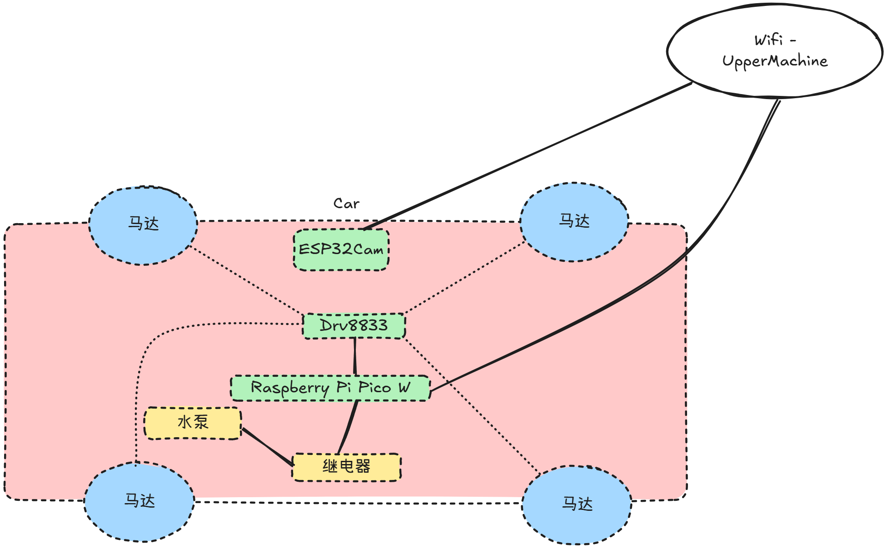

# LowerMachine

下位机部分区分为两个组成
- 摄像头模块
- 其他控制模块

两个模块都需要基于WIFI进行控制，将对应的代码保存到对应的设备即可，请在对应的下位机代码中，修改WIFI的SSID和PASSWORD，以便于连接对应的WIFI。

## 摄像头模块
摄像头模块采用ESP32Cam提供支持。

ESP32Cam的固件采用 https://github.com/lemariva/micropython-camera-driver/blob/master/firmware/micropython_camera_feeeb5ea3_esp32_idf4_4.bin

## 其他控制模块
其他控制模块采用 Raspberry Pi Pico 提供支持，型号为 Raspberry Pi Pico W/WH。

固件可以从以下地址下载 https://www.raspberrypi.com/documentation/microcontrollers/micropython.html

## 下位机硬件组成与连接方式

信号传输的引脚连接方式如下（供电注意正负极不要反接即可）

|引脚1|引脚2|
|--|--|
|Pico GP6|Drv8833 AIN1|
|Pico GP7|Drv8833 AIN2|
|Pico GP8|Drv8833 BIN1|
|Pico GP9|Drv8833 BIN1|
|Pico GP16|继电器 SIG|

