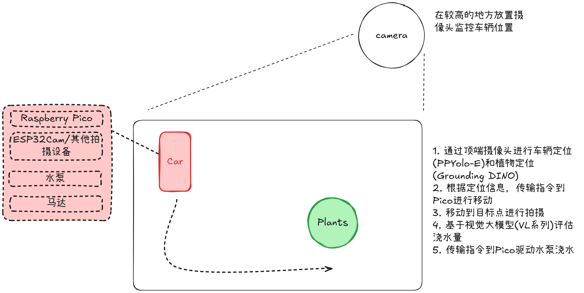

# AutoWaterer 自动浇花小车
本仓库目标构建一个自动浇花小车，用于自动识别环境内植株，自动设定并执行胶水计划。本工具的目标是在完全无人工干预的情况下，实现家庭环境下花卉的养护工作。（比如，当你需要出差约2个月时，可以通过该设备保障家庭内绿植的生长状态）

## 图示

## 硬件构成
本项目的硬件构成如下：
- 主控板
  - 树莓派Pico W/WH: 用于控制水泵和轮轴
  - ESP32Cam: 用于拍摄
- 元件/传感器
  - Drv8833 驱动板: 用于驱动轮轴
  - 水泵
  - 继电器: 控制水泵
  - 马达+轮轴: 用于移动
- 小型车体（你可以在中国电商平台随意购买一个DIY小车，如果你有3D打印机，也可以在当前共开的模型基础下进行修改，例如增加一些孔位 https://makerworld.com.cn/zh/models/648723-si-lun-che-di-pan-mo-xing#profileId-589619 ）
- WIFI
- 螺丝、铜柱、胶等按需购买
- 4K摄像头（清晰度更低时需要适当调整摄像头到拍摄平面的距离）
- PC（具有运行大模型的能力，或者能够通过API访问大模型服务）

## 软件逻辑

软件逻辑如下所示：

## 快速开始
施工中~

## 后续扩展
当前设备为裸机，没有进行走线优化，车体空间的利用率也不够好。后续将从如下角度进行扩展和优化
- 更换外壳设计，例如采用3D打印构置完全适配车体和功能需求的外壳
- 加装传感器
- 优化识别方案
- 开发同类项目，但主体不是小车
